# Docker container for Greenplum development/testing

## Requirements

- docker 1.13 (with 3-4 GB allocated for docker host)

PXF uses [Google Cloud Build](https://cloud.google.com/cloud-build) to produce
development images that reside in
[Google Container Registry (GCR)](https://cloud.google.com/container-registry).

The `cloudbuild` pipeline provides visibility into builds using Google Cloud
Builds. The `cloudbuild` pipeline triggers on changes to `pxf-dev-base` and
changes to `pxf-build-base` and is also in charge of tagging the images as
`latest` when they are pushed to GCR.

## Available docker images

|                  | Greenplum 5              | Greenplum 6                   | Greenplum 7                  |
|------------------|--------------------------|-------------------------------|------------------------------|
| CentOS 7         | `gpdb5-centos7-test-pxf` | `gpdb6-centos7-test-pxf`      | N/A                          |
| OEL 7            | N/A                      | `gpdb6-oel7-test-pxf`         | N/A                          |
| Ubuntu 18.04     | N/A                      | `gpdb6-ubuntu18.04-test-pxf`  | N/A                          |
| Rocky Linux 8    | N/A                      | `gpdb6-rocky8-test-pxf`       | `gpdb7-rocky8-test-pxf`      |
| MapR on CentOS 7 | N/A                      | `gpdb6-centos7-test-pxf-mapr` | N/A                          |

## Development docker image

A PXF development docker image can be pulled with the following command:

```shell script
docker pull gcr.io/${GCR_PROJECT_ID}/gpdb-pxf-dev/gpdb6-centos7-test-pxf-hdp2:latest
```

## Diagram of Container Image Building

This [Mermaid](https://mermaid.js.org/intro/) diagram details the docker images that are used and created by PXF pipelines and developers.

```mermaid
%%{init: {'theme':'neutral'}}%%
flowchart TD
  classDef subgraphStyle fill:none,stroke-dasharray:5,5,stroke:black
  classDef dockerhubStyle fill:#268bd2,color:white,stroke:none
  classDef gcrPublicStyle fill:#2aa198,stroke:none,color:white
  classDef dockerfileStyle fill:#fdf6e3,stroke:none
  classDef pipelineStyle fill:#d33682,color:white,stroke:none
  classDef latestStyle fill:#6c71c4,color:white,stroke:none
  classDef plainStyle fill:none,stroke:black

  subgraph dockerhub [Official DockerHub]
    centos7[centos:7]
    rocky8[rockylinux:8]
    class centos7 dockerhubStyle
    class rocky8 dockerhubStyle

  end
  class dockerhub subgraphStyle

  subgraph gcr_images ["GP RelEng Images (gcr.io/data-gpdb-public-images)"]
    gp5_centos7_latest[centos-gpdb-dev:7-gcc6.2-llvm3.7]
    gp6_centos7_latest[gpdb6-centos7-test:latest]
    gp6_ubuntu18_latest[gpdb6-ubuntu18.04-test:latest]
    gp6_oel7_latest[gpdb6-oel7-test:latest]
    gp6_rocky8_latest[gpdb6-rocky8-test:latest]
    gp7_rocky8_latest[gpdb7-rocky8-test:latest]

    class gp5_centos7_latest gcrPublicStyle
    class gp6_centos7_latest gcrPublicStyle
    class gp6_ubuntu18_latest gcrPublicStyle
    class gp6_oel7_latest gcrPublicStyle
    class gp6_rocky8_latest gcrPublicStyle
    class gp7_rocky8_latest gcrPublicStyle
  end
  class gcr_images subgraphStyle

  subgraph pxf_dev_base [pxf-dev-base/cloudbuild.yaml]
    gp5_centos7_dockerfile[gpdb5/centos7]
    gp6_centos7_dockerfile[gpdb6/centos7]
    gp6_rocky8_dockerfile[gpdb6/rocky8]
    gp6_ubuntu18_dockerfile[gpdb6/ubuntu18.04]
    gp6_oel7_dockerfile[gpdb6/oel7]
    gp7_rocky8_dockerfile[gpdb7/rocky8]

    class gp5_centos7_dockerfile dockerfileStyle
    class gp6_centos7_dockerfile dockerfileStyle
    class gp6_rocky8_dockerfile dockerfileStyle
    class gp6_ubuntu18_dockerfile dockerfileStyle
    class gp6_oel7_dockerfile dockerfileStyle
    class gp7_rocky8_dockerfile dockerfileStyle
  end
  class pxf_dev_base subgraphStyle

  subgraph rpmrebuild [rpmrebuild/cloudbuild.yaml]
    rpm_docker_centos7[centos/Dockerfile]
    rpm_docker_rocky8[rocky/Dockerfile]

    class rpm_docker_centos7 dockerfileStyle
    class rpm_docker_rocky8 dockerfileStyle
  end
  class rpmrebuild subgraphStyle

  subgraph gcr_data_gpdb_ud [gcr.io/data-gpdb-ud]
    subgraph gpdb_pxf_dev [gpdb-pxf-dev]
      gp5_centos7_pxf_sha[gpdb5-centos7-test-pxf:$COMMIT_SHA]
      gp6_centos7_pxf_sha[gpdb6-centos7-test-pxf:$COMMIT_SHA]
      gp6_rocky8_pxf_sha[gpdb6-rocky8-test-pxf:$COMMIT_SHA]
      gp6_ubuntu18_pxf_sha[gpdb6-ubuntu18.04-test-pxf:$COMMIT_SHA]
      gp6_oel7_pxf_sha[gpdb6-oel7-test-pxf:$COMMIT_SHA]
      gp7_rocky8_pxf_sha[gpdb7-rocky8-test-pxf:$COMMIT_SHA]

      class gp5_centos7_pxf_sha plainStyle
      class gp6_centos7_pxf_sha plainStyle
      class gp6_rocky8_pxf_sha plainStyle
      class gp6_ubuntu18_pxf_sha plainStyle
      class gp6_oel7_pxf_sha plainStyle
      class gp7_rocky8_pxf_sha plainStyle

      gp5_centos7_pxf_latest[gpdb5-centos7-test-pxf:latest]
      gp6_centos7_pxf_latest[gpdb6-centos7-test-pxf:latest]
      gp6_rocky8_pxf_latest[gpdb6-rocky8-test-pxf:latest]
      gp6_ubuntu18_pxf_latest[gpdb6-ubuntu18.04-test-pxf:latest]
      gp6_oel7_pxf_latest[gpdb6-oel7-test-pxf:latest]
      gp7_rocky8_pxf_latest[gpdb7-rocky8-test-pxf:latest]

      class gp5_centos7_pxf_latest latestStyle
      class gp6_centos7_pxf_latest latestStyle
      class gp6_rocky8_pxf_latest latestStyle
      class gp6_ubuntu18_pxf_latest latestStyle
      class gp6_oel7_pxf_latest latestStyle
      class gp7_rocky8_pxf_latest latestStyle
    end
    class gpdb_pxf_dev subgraphStyle

    rpm_centos7_latest[rpmrebuild-centos7:latest]
    rpm_rocky8_latest[rpmrebuild-rocky8:latest]

    class rpm_centos7_latest latestStyle
    class rpm_rocky8_latest latestStyle
  end
  class gcr_data_gpdb_ud subgraphStyle

  subgraph local_use_only [For local development use]
    subgraph pxf_dev_server [pxf-dev-server/cloudbuild.yaml]
      server_dockerfile[Dockerfile]
      class server_dockerfile dockerfileStyle
    end
    class pxf_dev_server subgraphStyle

    subgraph mapr [mapr/cloudbuild.yaml]
      mapr_dockerfile[Dockerfile]
      class mapr_dockerfile dockerfileStyle
    end
    class mapr subgraphStyle

    subgraph gcr_data_gpdb_ud_mapr ["MapR Images (gcr.io/data-gpdb-ud)"]
      gp6_centos7_pxf_mapr_sha[gpdb-pxf-dev/gpdb6-centos7-test-pxf-mapr:$COMMIT_SHA]
      gp6_centos7_pxf_mapr_latest[gpdb-pxf-dev/gpdb6-centos7-test-pxf-mapr:latest]

      class gp6_centos7_pxf_mapr_sha plainStyle
      class gp6_centos7_pxf_mapr_latest latestStyle
    end
    class gcr_data_gpdb_ud_mapr subgraphStyle

    subgraph gcr_data_gpdb_ud_hdp2 ["HDP2 (gcr.io/data-gpdb-ud)"]
      gp6_centos7_pxf_hdp2_sha[gpdb-pxf-dev/gpdb6-centos7-test-pxf-hdp2:$COMMIT_SHA]
      gp6_centos7_pxf_hdp2_latest[gpdb-pxf-dev/gpdb6-centos7-test-pxf-hdp2]

      class gp6_centos7_pxf_hdp2_sha plainStyle
      style gp6_centos7_pxf_hdp2_latest fill:#b58900,color:white,stroke:none
    end
    class gcr_data_gpdb_ud_hdp2 subgraphStyle
  end
  class local_use_only subgraphStyle

  subgraph pipelines [Pipelines]
    certification
    perf
    longevity
    build[pxf-build]
    pr[pxf_pr_pipeline]

    class certification pipelineStyle
    class perf pipelineStyle
    class longevity pipelineStyle
    class build pipelineStyle
    class pr pipelineStyle
  end
  class pipelines subgraphStyle

  gp5_centos7_latest --> gp5_centos7_dockerfile
  gp5_centos7_dockerfile -- CloudBuild --> gp5_centos7_pxf_sha
  gp5_centos7_pxf_sha -- "tag (concourse pipeline)" --> gp5_centos7_pxf_latest

  gp6_centos7_latest --> gp6_centos7_dockerfile
  gp6_centos7_dockerfile -- CloudBuild --> gp6_centos7_pxf_sha
  gp6_centos7_pxf_sha -- "tag (concourse pipeline)" --> gp6_centos7_pxf_latest

  gp6_rocky8_latest --> gp6_rocky8_dockerfile
  gp6_rocky8_dockerfile -- CloudBuild --> gp6_rocky8_pxf_sha
  gp6_rocky8_pxf_sha -- "tag (concourse pipeline)" --> gp6_rocky8_pxf_latest

  gp6_ubuntu18_latest --> gp6_ubuntu18_dockerfile
  gp6_ubuntu18_dockerfile -- CloudBuild --> gp6_ubuntu18_pxf_sha
  gp6_ubuntu18_pxf_sha -- "tag (concourse pipeline)" --> gp6_ubuntu18_pxf_latest

  gp6_oel7_latest --> gp6_oel7_dockerfile
  gp6_oel7_dockerfile -- CloudBuild --> gp6_oel7_pxf_sha
  gp6_oel7_pxf_sha -- "tag (concourse pipeline)" --> gp6_oel7_pxf_latest

  gp7_rocky8_latest --> gp7_rocky8_dockerfile
  gp7_rocky8_dockerfile -- CloudBuild --> gp7_rocky8_pxf_sha
  gp7_rocky8_pxf_sha -- "tag (concourse pipeline)" --> gp7_rocky8_pxf_latest

  centos7 --> rpm_docker_centos7
  rpm_docker_centos7 --> rpm_centos7_latest
  rocky8 --> rpm_docker_rocky8
  rpm_docker_rocky8 --> rpm_rocky8_latest

  gp5_centos7_pxf_latest --> mapr_dockerfile
  gp6_centos7_pxf_latest --> mapr_dockerfile
  mapr_dockerfile -- "CloudBuild (install MapR)" --> gp6_centos7_pxf_mapr_sha
  gp6_centos7_pxf_mapr_sha -- "tag (concourse pipeline)" --> gp6_centos7_pxf_mapr_latest

  gp6_centos7_pxf_latest --> server_dockerfile
  server_dockerfile -- "CloudBuild (add singlecluster, build deps, & automation deps)" --> gp6_centos7_pxf_hdp2_sha
  gp6_centos7_pxf_hdp2_sha --> gp6_centos7_pxf_hdp2_latest

  gp5_centos7_pxf_latest --> certification
  gp5_centos7_pxf_latest --> build
  gp5_centos7_pxf_latest --> pr

  gp6_centos7_pxf_latest --> certification
  gp6_centos7_pxf_latest --> longevity
  gp6_centos7_pxf_latest --> perf
  gp6_centos7_pxf_latest --> build
  gp6_centos7_pxf_latest --> pr

  gp6_rocky8_pxf_latest --> certification
  gp6_rocky8_pxf_latest --> perf
  gp6_rocky8_pxf_latest --> build
  gp6_rocky8_pxf_latest --> pr

  gp6_ubuntu18_pxf_latest --> certification
  gp6_ubuntu18_pxf_latest --> build
  gp6_ubuntu18_pxf_latest --> pr

  gp6_oel7_pxf_latest --> build
  gp6_oel7_pxf_latest --> pr

  gp7_rocky8_pxf_latest --> certification
  gp7_rocky8_pxf_latest --> build
  gp7_rocky8_pxf_latest --> pr

  rpm_centos7_latest --> build
  rpm_rocky8_latest --> build
```


